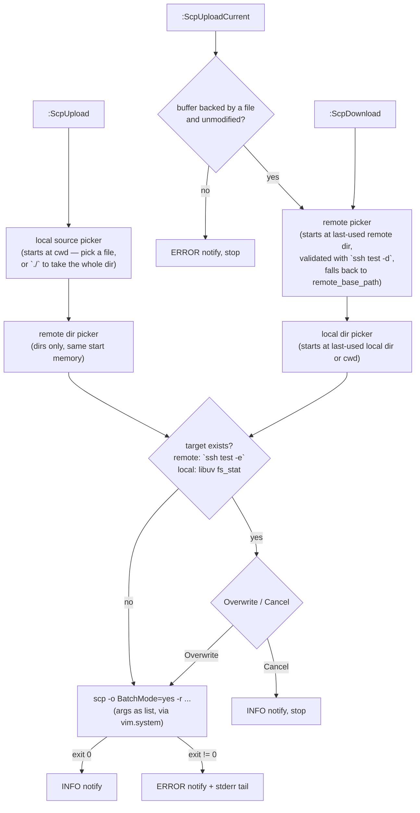

# nvim-scp

Upload and download files and directories between Neovim and a remote host over
plain `scp` — no rsync, no third-party servers, no daemons. Key authentication
only. Telescope-driven, fully async (`vim.system`).

Works with any host defined in your `~/.ssh/config` (key authentication only).

## Requirements

- Neovim 0.10+
- [telescope.nvim](https://github.com/nvim-telescope/telescope.nvim)
- OpenSSH `ssh` + `scp` on your PATH (Windows OpenSSH works; local paths are
  converted to `C:/...` forward-slash form automatically)

## Setup

```lua
-- lazy.nvim
{
  "j4rviscmd/nvim-scp",
  -- Point at a local checkout for now (example path). Remove the `dir` line
  -- once the repo is installed from GitHub instead.
  -- On Windows: dir = "C:\\work\\nvim-scp"
  dir = "~/work/nvim-scp",
  dependencies = { "nvim-telescope/telescope.nvim" },
  opts = {
    host = "remote-server",    -- REQUIRED: Host name in ~/.ssh/config
    remote_base_path = "~",    -- where remote browsing starts (default "~")
  },
}
```

`host` is validated lazily: you may load the plugin without it, but running any
command without a host shows an error notification.

## Commands

| Command | What it does |
|---|---|
| `:ScpUpload` | Pick a local file or directory, pick a remote directory, push |
| `:ScpUploadCurrent` | Pick a remote directory (starts at the last-used one), push the current buffer's file |
| `:ScpDownload` | Pick a remote file or directory, pick a local directory, pull |

### Browsing

Both browsers share the same Telescope UI:

- `<CR>` on a directory descends into it
- `./` confirms the current directory as the target (upload the whole dir, etc.)
- `<CR>` on a file picks it (where files are selectable)
- `..` goes to the parent; `~` (remote) and the filesystem root are hard limits
- `<Esc>` cancels

If the target already exists (checked before every transfer), you get an
`Overwrite / Cancel` prompt. Cancelling is silent.

`:ScpUploadCurrent` refuses to run on modified buffers (save first) and on
buffers with no backing file.

## Keymaps (suggested)

```lua
vim.keymap.set("n", "<leader>su", "<cmd>ScpUpload<cr>", { desc = "SCP upload" })
vim.keymap.set("n", "<leader>sc", "<cmd>ScpUploadCurrent<cr>", { desc = "SCP upload current file" })
vim.keymap.set("n", "<leader>sd", "<cmd>ScpDownload<cr>", { desc = "SCP download" })
```

## Behavior notes

- Transfers run async; multiple transfers may run in parallel.
- `BatchMode=yes` is always passed, so a dead tunnel fails fast instead of
  hanging on a password prompt.
- Remote listings use `ls -1F`; symlinks are treated as files (not descendable).
- The last-used remote dir and local download dir are remembered for the
  session only (in-memory) and used as the starting point of every picker; if a
  remembered remote dir was deleted remotely, browsing falls back to
  `remote_base_path` with a warning. The upload source picker always starts at
  the current working directory.

## Flow

How a transfer flows end to end. All remote/transfer steps are async
(`vim.system`); both browsers share one Telescope picker builder — local via
`vim.fs`, remote via `ssh ls -1F`.



## Development

No test framework; verification is a manual smoke test against a real host
(the `host` from `setup()`), on both Windows and macOS:

1. `setup()` without `host` → commands error gracefully (ERROR notify)
2. `:ScpUpload` file → lands on remote, success notify
3. `:ScpUpload` dir (`./` confirm inside it) → dir lands on remote
4. `:ScpUploadCurrent` twice → second picker opens at the last-used dir
5. `:ScpUploadCurrent` on a modified buffer → ERROR, no transfer
6. `:ScpUploadCurrent` on a non-file buffer (netrw etc.) → ERROR, no transfer
7. `:ScpDownload` file and dir both work
8. Overwrite prompt appears in both directions; Cancel aborts silently
9. Tunnel down → fast `BatchMode` error, no hang
10. `../` and `./` navigation in both browsers
11. Path with spaces transfers correctly
12. Windows: `C:\...` converts to `C:/...`, scp succeeds with Windows OpenSSH

Lua formatting: [stylua](https://github.com/JohnnyMorganz/StyLua)
(`stylua.toml`); formatting runs in CI, no need to run it by hand.

## Roadmap

### Post-MVP

- [x] Project `CLAUDE.md` — dev conventions (branching, commit style, stylua)
- [x] CI — stylua format check + selene lint
- [ ] LICENSE (MIT) and going public
- [ ] Minimal tests — headless path helper checks
- [ ] mkdir from picker — create a new directory inside the destination picker
- [ ] Multi-select batch transfer — telescope tab-selection of several files
- [ ] `scp -C` compression — opt-in via config (`compress = true`)
- [ ] Transfer progress display
- [ ] Persist last-used dirs across sessions
- [ ] Multi-host profiles
- [ ] Auto-upload on save (opt-in)
- [ ] Neo-tree / oil.nvim integration
- [ ] rsync / differential sync
- [ ] Rename on conflict — when the target already exists, offer
  Overwrite / Rename / Cancel (the rename option only appears then)

## License

TBD (MIT, added when the repo goes public).
